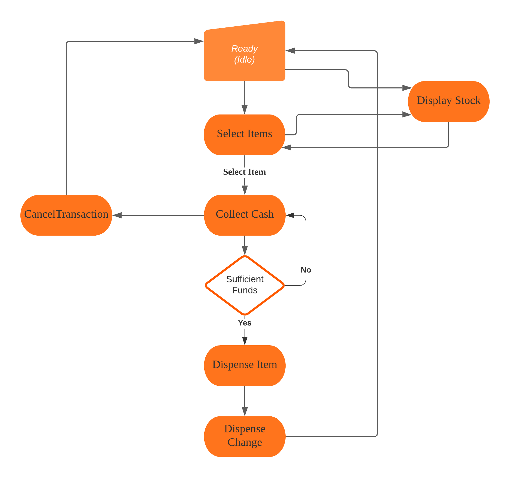
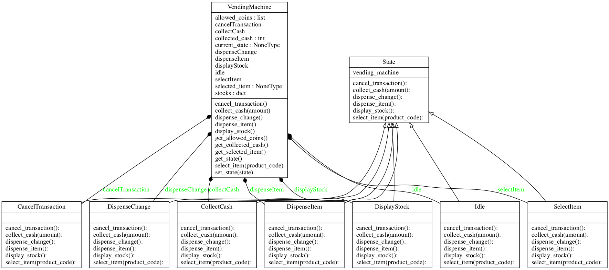
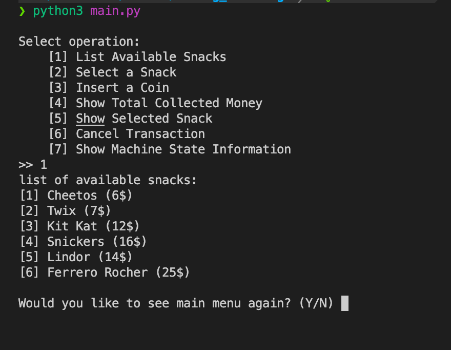

# Coding challenge

## Vending Machine Design

So starting with assumption for simple vending machines design, we will assume the machine start by:
User start interacting with the machine by checking list of snacks/prices, select a snack, put money into the machine and receive money back etc.

So in the following order:

```
list snacks -> select snack -> receive money (for example only 1$, 2$, 5$ until money inserted >= price)
-> dispense item -> dispense change.
```

## Requirements (specs and desired functionalities)

- A person should be able to browse machine available items
- A person should be able to choose an item & insert cash into the machine
- The Machine should keep track of the inserted cash with the price of the selected item
- The machine must display an option to cancel the operation
- Finally, if all the above steps succeed then the user gets the selected item and the remaining cash if any

Following is a UML representation of the Activity diagram:



## Create a Skeleton Implementation

So based on the presented requirements, we would be start thinking of possible solutions in order for us to implement the system.

the first solution may come to my mind would be considering having VendingMachine class with different methods for user interaction with the system, the limitation with this design it will require switch case block in each system method, in addition to a lot of code redundancy.

Which make it hard to maintain and with high change of error prone.
So instead we would need to implement a solution to encapsulated all the business logic, with respect to SOLID principles, in way introducing new functionality wouldn't require modifications of behavior of the current classes.
So we would start by declare a state interface which exposes the main functionalities:
**idle**, **display_stock**, **select_item**, **collect_cash**, **dispense_item**, **dispense_change**, **cancel_transaction**

All of these states will be implementing the state interface, and we will be having `Vending Machine` class which will be the context handle the management for system and instance reference.

With the following class diagram:



Finally we have the test client module `main.py` which is simple client have the UI control, to let the user interact with the system and send commands to context (vending machine class) which will take it from there.

## Advantages and Disadvantages

With the above design, creating new state can be straightforward by extending the state interface with minimal changes with respect for open/close principle by not changing the classes behavior, in addition to decouple it from each other, and splitting the implementation from the design interface.

It's a good idea to use the state pattern if the logic of each state is complex and the states change frequently.
However, applying the pattern can be overkill sometimes if a state machine has only a few states or rarely changes.
In addition, in case the number of states and transitions increase over time, the whole design may becomes quickly very complex.

## Usage

- this example would required **python3.6+**

- running the code would be calling the main module

```bash
python3 main.py
```

Then selecting the operation from the menu list


